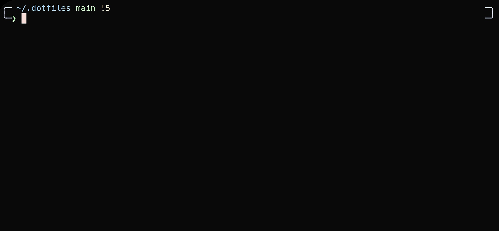
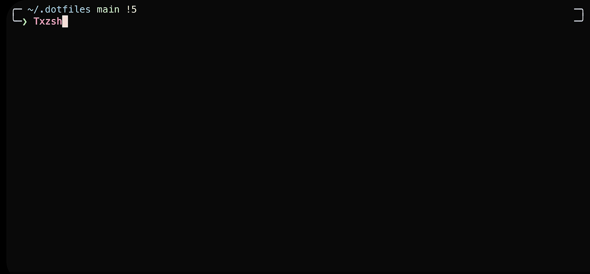

# TXzsh

**Zsh configuration for Termux with p10k theme**

## Preview





## Features

- Minimal and lightweight configuration
- Easy setup process
- `zinit` plugin manager
- Preconfigured components:
    - Nerd font support
    - Auto-suggestions with `zsh-autosuggestions` plugin
    - Syntax highlighting with `zsh-syntax-highlighting` plugin
    - Beautiful fzf integration
    - p10k theme setup
- Random colored ASCII art at startup with `random_colors` script
- Custom black themed color scheme
- Perfect starting point for your own configuration

## Requirements

- [Termux app](https://github.com/termux/termux-app/releases/)
- [Termux:API](https://github.com/termux/termux-api/releases)
- Internet connection for downloading plugins and packages

> [!WARNING]  
> Download Termux from GitHub or F-Droid, not Google Play Store

## Installation

**1. Install zsh**
```bash
apt install zsh -y
```

**2. Set zsh as default shell**
```bash
chsh -s zsh
```

> [!CAUTION]  
> After changing shell, restart Termux and verify with `echo $SHELL` or `echo $0`

**3. Clone and install**
```bash
git clone https://github.com/BayonetArch/zsh-style-termux.git
cd zsh-style-termux
chmod +x install.sh
./install.sh
```

The install script will automatically set up all required packages and configurations.

## Configuration

### Theme customization
- p10k configuration
- Color scheme settings
- Font settings

### Plugin management
- Adding new plugins
- Managing zinit
- Plugin updates

### Custom settings
- Aliases and functions
- Environment variables
- Shell options

## Troubleshooting

### Installation issues
- Permission errors
- Package installation problems
- Script execution failures

### Theme and display
- Font rendering problems
- p10k theme not showing
- Color display issues

### Plugin problems
- Plugins not loading
- Update failures
- Performance issues

### Shell configuration
- Default shell not changing
- Configuration not loading
- Path issues
