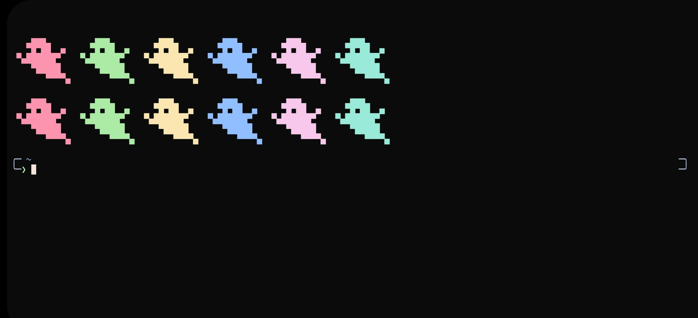

# TXzsh

**Zsh configuration for Termux with p10k theme**

## Preview




## Features

- Minimal and lightweight configuration
- Easy setup process
- `zinit` plugin manager
- Preconfigured components:
    - Nerd font support
    - Auto-suggestions with `zsh-autosuggestions` plugin
    - Syntax highlighting with `zsh-syntax-highlighting` plugin
    - Beautiful fzf integration
    - p10k theme setup
- Random colored ASCII art at startup with `random_colors` script
- Custom black themed color scheme
- Perfect starting point for your own configuration

## Requirements

- [Termux app](https://github.com/termux/termux-app/releases/)
- [Termux:API](https://github.com/termux/termux-api/releases)
- Internet connection for downloading plugins and packages

> [!WARNING]  
> Download Termux from GitHub or F-Droid, not Google Play Store

## Installation

**1. Install zsh**
```bash
apt install zsh -y
```

**2. Set zsh as default shell**
```bash
chsh -s zsh
```

> [!CAUTION]  
> After changing shell, restart Termux and verify with `echo $SHELL` or `echo $0`

**3. Clone and install**
if your default shell is `zsh` you can clone and run the install script 
```bash
git clone https://github.com/BayonetArch/zsh-style-termux.git
cd zsh-style-termux
chmod +x install.sh
./install.sh
```

The install script will automatically set up all required packages and configurations.

## Configuration


# Promt  configurations
**you can configure your zsh prompt as your liking!**
**just run `p10k configure` after Installation is finished**

# adding new plugins
**adding new plugins is just simple zinit line**
you can add your own plugins in the `$HOME/.zshrc` file
<br></br>
just to the comment where it says plugins and add line like this
```bash
zinit light zsh-users/zsh-syntax-highlighting #example of adding zsh syntax highlighting
```


```bash
zinit light {plugin name} 
```
# keybinds
**look for keybinds in the `.zshrc` if you want to customize it**
<br></br>
Here are basic keybinds:

| Shortcut       | Action                                |
|----------------|----------------------------------------|
| `Ctrl + R`     | Search command history with **fzf**    |
| `Ctrl + F`     | Accept autosuggestion                  |
| `Ctrl + P`     | Search backward in history             |
| `Ctrl + N`     | Search forward in history              |
| `Ctrl + Shift + P` | Alternate key for **fzf** history search |

## Troubleshooting

**If you run into any issues or have questions, feel free to ask in the comments on my [YouTube channel](https://www.youtube.com/@Bayonet7) or open an issue in this repo. I’ll try to respond as soon as I can.**


